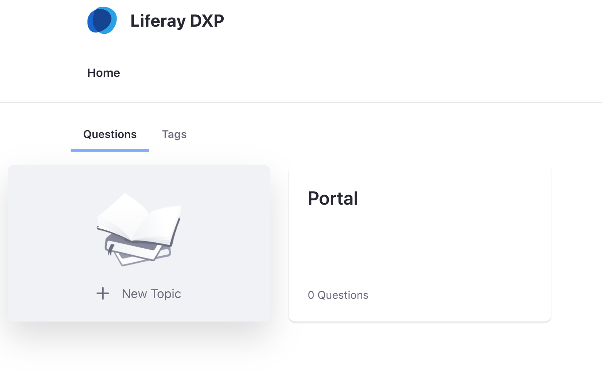

# Questions Documentation

## Introduction
Questions is a new way to create Forums in Liferay more focused in a questions and answers format with a new UI.
Build over Message Board base, Questions allows the creation of the following main elements:
* Topics: Themes where categorize the questions asked.
* Questions: A question inside the app.
* Answers: An answer to a specific question or another answer.

When some user creates a question he/she could create a tag to categorize the questions with more accuracy. This will be discussed later.

## How to create a topic
As it says before, a topic is a theme where it is possible to categorize the questions. Create a new topic is as easy as click on the "New Topic" button. This button could be in two places:
* On the cards page, which is the main page of the application.
* On the breadcrumb of Questions, which appears when the user goes into a topic or the user deactivate the cards page (will be discussed later).

 

When the user clicks on the button will appear a modal that allows setting the title and the description of the topic. The title is necessary to create the topic. One a time the data is set, it just to push in the "Create" button.

What was created is a theme where the user could make or find questions related to the topic, e.g., the topic "Commerce" which contains questions related to Liferay product Commerce. Where is it possible to find the topics?
* On the cards page, which contains the topics created.
* In the breadcrumb, where the user can navigate between the different topics.

### Subtopics
As it exists the topics, also exist the subtopics, i.e., topics inside other topics. With this, it is possible to categorize in a mayor level each theme. For example, a user can create a general topic named Portal with subtopics as Collaboration, Web experience, and Forms.
To create a subtopic, it is necessary to be inside of a topic and use the "create topic" button as explained early.

IMPORTANT: It is necessary to have the proper permissions to create a topic or a subtopic.

## How to create a Question
To create a question, the user has to go inside the topic where he/she wants to make that question and then click on the "Ask question" button. This action will navigate to the questions creation page. On this page, the user must enter the headline of the question as well as the question body.
Also, it is possible to select the topic or direct subtopic in where wants to include the question.

The Questions app supports the use of tags to categorize more using keywords related to the questions. To do this, it could use tags that already exist or create new ones.

The page of question creation has a section related to tags where the user can search for tags using the selector or the autocomplete functionality. If he/she wants to create a new tag it just has to type it in the input and press enter

Once all data has been introduced, the final step is to publish the question by clicking on the "Post Yor Question" button.

IMPORTANT: To create a question, it must have the proper permissions.

## How to answer other users
To create an answer, it has to select the question that wants to answer. At the bottom of the detail page of the question, the user will found the CKEditor to create an answer.
Also, it is possible to create responses to other answers. To do this, the user should click on the "Reply" button at the bottom of an answer.

### Mark answer as valid
Mark an answer as valid is as easy as clicking on the "Mark as valid" button.

IMPORTANT: The user must have the proper permission to make this action. In another case, the button to mark as valid will not appear. By default, the administrator and the creator of the question can mark an answer as valid.

## Rating questions
The Questions app also includes a rating for questions and answers. If a user thinks that a question or answer is interesting, he/she can vote positively using the up arrow near to the question or answer.
In the case that the user does not like the question or answer, he/she can also vote negatively.

## Searching questions
The questions app allows to search questions in different ways:
* Through the pagination at the bottom of the page. In case there are not enough questions, the pagination will not appear.
* Through text or keywords
* Through tags

### Search by text
To search for questions by text or keywords, the user can use the search box placed at the top of the application. When he/she introduces the input, the application will load the information related to its search.

### Search by tags
Exists two different ways to filter questions by tags:
Clicking on the tag of a question of the question list. This will filter the list by questions that have the tag and belong to the topic or subtopics where the user is.

Using the Tags tab which contains the created tags. When selecting a tag the application will search for ALL the questions that have it. Also exists a search box to help in the selection of a tag.

## My subscriptions
An attractive feature of Questions is the possibility of subscribing to interesting themes.
The Questions application supports two types of subscriptions:
* Subscription to a topic
* Subscription to a question

By default, users will be subscribed to the questions they create.

### Manage subscriptions
How can the users subscribe to a topic? The topics have a "Subscribe" button just below the breadcrumb. When the users click on this button will be subscribed to the topic where they are.

How can the users subscribe to a question? As said before, users are subscribed to the questions they make by default. In the detail of the question, there is a button with a bell that represents the subscription. There is where the user can subscribe or unsubscribe.

Of course, the users can subscribe to all topics and all questions they want but, this generates a question: If a user has a lot of subscriptions, how he/she could manage all of that? Well, exist another tab named My Subscription. In this tab, the users can see their subscriptions to the topics and questions and, of course, can unsubscribe or navigate to these topics and questions.

## My activity
The last tab in Questions is the named: My Activity. In this tab, the users can view statistics of their use of the application, as:
* Number of questions posted in the application
* Their rank. Based on the number of posts.
* Their latest questions asked. Of course, the users can navigate to these questions by clicking on them.

All of this information is provided to the users to make accessible their activity easily.

## Managing questions
Questions application has many different configurations to help users with their requests.
These configurations are:
* Show the cards for topic navigation (what we call the landing page).
* Select a specific root topic. So, if there are many topics and subtopics, this configuration allows using Questions with a subtopic as the root topic.
* Enable redirection to login when a user does not have permission to make an action.
* Use topic names in the URL instead of the topic ID.

## Configuration
### Configuration from the portlet
The configurations accessible by portlet configuration are:
* Show Cards for Topic Navigation
* Selection of a specific root topic.

The first one has a direct consequence in the navigation of the application. If the checkbox is marked, when the users click on the home icon or go to the main page of the Questions application, they will see a page with the available topics. If the checkbox is not marked, when users go to the main page of the app will see the list of questions of the root topic and its direct children.

All the mentioned above has a direct relation with the second configuration available: the selection of a specific root topic. What does that mean?

Well, that means that the user can configure the Questions application to work with a specific main topic and not works only with the root of all. For example, imagine that there is more than one category in the Message Boards* created for other purposes. To not affect that category it is possible to create another one specific for questions. So, the user will have 2 categories: Questions and Other.

Now, in the Questions application, he/she can go to the configuration and select through the item selector the root category.

With this, all the information created in the app (topics, questions, etcetera) will be saved in the topic selected. Also, the main page will show the topics or questions of the new root topic, depending on the checkbox explained previously.

*NOTE: remember that the Questions app is built over message boards.

### Configuration from System setting
There are other configurations available from System Settings plus the mentioned above, and it affects the application globally. These are:
* Enable redirection to login.
* Use topic names in the URL.

The first one is to redirect to the login page when a user tries to do an action that is not allowed. For example, if there are no questions inside a topic an empty message will show with the possibility to create a new question. If the user has the Guest role and Guests are not allowed to do a question, when they click on the button will be redirected to the login page.
If the option of redirection is not marked, the user will get an error message telling him that is not allowed to do that action.

The second one is related to the URL. It could be interesting to use the topics names in the URL to make it more readable for users but there is a disadvantage: the topics could not have the same name. If the topics have the same name the application could not work correctly.

In the case that is mandatory to have two or more topics with the same name it is recommendable to use the ID of the topics, that is, not mark the checkbox to use the topics name in the URL.

ProTip: It is possible to add configurations creating a .config file named "com.liferay.questions.web.internal.configuration.QuestionsConfiguration-default.config"
The properties are:
* enableRedirectToLogin (Boolean)
* showCardsForTopicNavigation (Boolean)
* useTopicNamesInURL (Boolean)
* rootTopicId (Long)
